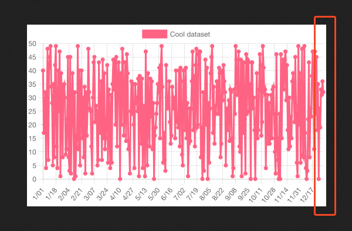
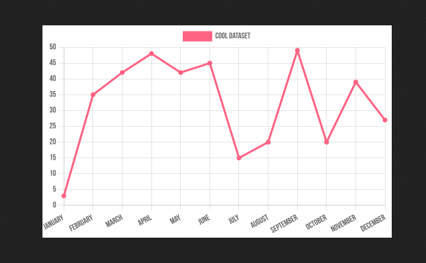

# NodeJS with Chart.js in NodeJS Example

## Why this?

This repo are made to reproduce issue [#11798](https://github.com/chartjs/Chart.js/issues/11798) in the Chart.js repository. I'm facing a problem where the chart are rendered with overflow in the canvas.

## How to run 😼

Do the things you'd normally do. There's no yarn here, just npm 🐈.

```bash
npm install
npm start
```

## How to reproduce 🙀

1. Open `http://localhost:3000/generate` in your browser, and validate that you get a answer.
2. Open `http://localhost:3000/generate?case=invalid` in your browser, and you'll get a chart with overflow ([Issue 11798](https://github.com/chartjs/Chart.js/issues/11798)).
3. Open `http://localhost:3000/generate?case=valid` in your browser, and you'll get a chart without overflow.


See `http://localhost:3000/` for examples.

## Visual example of outputs 😸


### Issue 😿

Get the issue without annotations and defaults in the chart: `http://localhost:3000/generate?type=invalid&opts=no-annotations,no-defaults`



### OK 😸

Get a OK scenario without annotations and defaults in the chart: `http://localhost:3000/generate?type=ok&opts=no-annotations,no-defaults`

